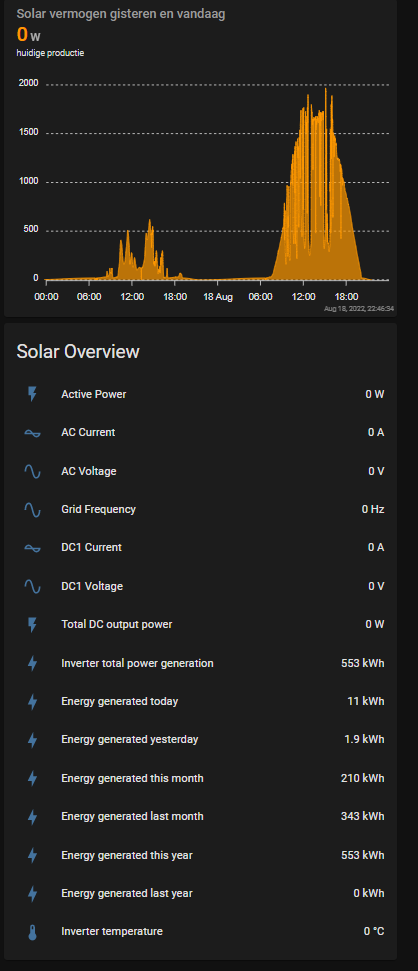
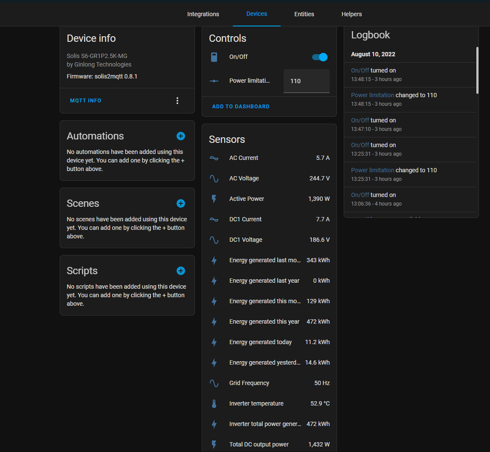
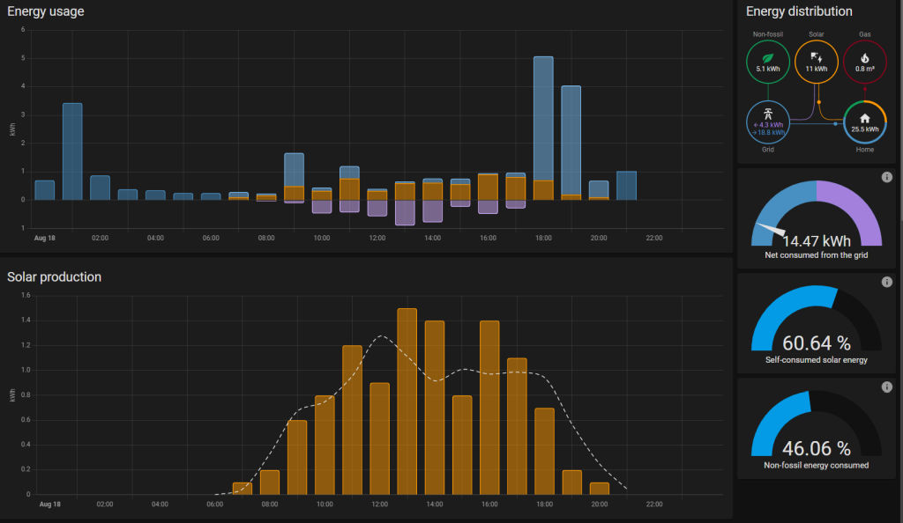

# A MQTT bridge for Solis solar inverters. ##

## Foreword

I want to start by extending my deepest gratitute to incub who owns the [solis2mqtt](https://github.com/incub77/solis2mqtt) repository which served as a base for this one (from now on I call his repo the _original_).

I made several changes:
1. The python script will run single pass, single task. Rationale behind this is that all initializations, cleanup, et cetera is taken care of by the Operation System and is done at **every** run of the script.
2. In situations that the inverter is unreachable, the sun altitude is used to determine whether this is normal or not. Normal: long wait time, not normal: try again soon.
3. An additional run.sh is added to do the repeating. Sleep duractions are based on the errorlevel of the script.
4. Additional sensors are added to the solis_modbus.yaml file, like the v_dc1, i_dc1, v_ac, i_ac and grid frequency.
5. The On/Off switch and Power limitation are removed because of these changes. They require a continuous listener and that does not fit this design principle. If you need this, use the _original_.

All text marked with an <sup>*</sup> is the original text from *incub*.

### Ad 1

When using the _original_ I observed that the connection to the inverter was lost quite fast, like after 10-20 runs. The _original_ then just waits for a longer period of time to try again. There is no reinitialization of the serial port. This observation let me to do this work. Of course I could have put some serial reinitialization into the _original_ but I leave that to another volunteer. And yes, I know I had to sacrfice the On/Off switch and the ability to change the Power limitation.

## Introduction<sup>*</sup>

Solis solar inverters are equipped with an RS485 interface, through which telemetry values can be read and also control
commands can be sent. The manufacturer offers LAN and WLAN sticks in combination with a software solution to access the
interface. Unfortunately, this is always coupled with a connection to the manufacturer's cloud and integration into a
home automation system is only possible in a detoured manner.
This software acts as a bridge between the RS485 interface and a MQTT broker to allow easy integration into a
home automation (with special support for Home Assistant), and furthermore without cloud constraints.

## Hardware

* The inverter uses a proprietary(?) RS485 plug, with the following pin-out (at least on my wifi stick, it is different than described in the _original_):
```
  /-----\
  | 1 4 |
  | 2 3 |
  \--^--/
```

1. +5V
2. GND
3. DATA+ (A)
4. DATA- (B)

* Any RS485 adapter should do I think. FYI: I use the [USB 2.0 RS485 interface FTDI](https://www.benselectronics.nl/usb-20-rs485-interface-ftdi.html). 
* I highly recommend using a proper connector, which can be found on
[ebay](https://www.ebay.nl/itm/234632173812) (search for "RS485 Solis" or
"Exceedconn EC04681-2014-BF") and solder the wires to it.
* I run the software on a Raspberry Pi 3 Model B Rev 1.2B, but any Linux box should do I guess.

## Installation

* Download and install to /opt/solis2mqtt

`wget https://github.com/hvoerman/solis2mqtt/archive/main.tar.gz -O - | sudo tar -xvzf - --one-top-level=/opt/solis2mqtt --strip 1`

* Execute setup.sh. This will basically install dependencies, add a system user for the daemon to run in and setup
systemd.

`sudo bash /opt/solis2mqtt/setup.sh`

* To see whether or not the converter is connected, use:

`lsusb`

My output is

```
Bus 001 Device 004: ID 0403:6001 Future Technology Devices International, Ltd FT232 Serial (UART) IC
Bus 001 Device 003: ID 0424:ec00 Microchip Technology, Inc. (formerly SMSC) SMSC9512/9514 Fast Ethernet Adapter
Bus 001 Device 002: ID 0424:9514 Microchip Technology, Inc. (formerly SMSC) SMC9514 Hub
Bus 001 Device 001: ID 1d6b:0002 Linux Foundation 2.0 root hub
```

The `Future Technology Devices International, Ltd FT232 Serial (UART) IC` is the one we're looking for. I use `/dev/ttyUSB0` in my config.yaml

* Edit `config.yaml`. See section [Basic Configuration](#basic-Configuration).

e.g. `sudo vi /opt/solis2mqtt/config.yaml`

* A reboot is necessary for user rights (access to /dev/ttyUSB*) to become effective.

`sudo reboot`

## Usage<sup>*</sup>

Solis2MQTT is intended to run as a system service. A log file is written to `/opt/solis2mqtt/solis2mqtt.log`. To control
the service, the usual systemd commands are used:
* Start: `sudo systemctl start solis2mqtt`
* Stop: `sudo systemctl stop solis2mqtt`
* Restart: `sudo systemctl restart solis2mqtt`
* Disable start on boot: `sudo systemctl disable solis2mqtt`
* Enable start on boot: `sudo systemctl enable solis2mqtt`

To check if the service is running you can do a `ps -efH | grep solis2mqtt`. The output should look something like this:
```
solis2m+   460     1  0 22:53 ?        00:00:08   /usr/bin/python3 solis2mqtt.py -d
pi         559   501  0 23:13 pts/0    00:00:00           grep --color=auto solis2mqtt
```

If Solis2MQTT doesn't start up to a point where the log file is written you can check `/var/log/syslog` for clues.

For development/debugging Solis2MQTT can also be started directly. Make sure to change to the working directory before doing so.
```
cd /opt/solis2mqtt
python ./solis2mqtt_v2.py -s
```
The following command line arguments are implemented:
* `-v` or `--verbose` Verbose mode. Will output debug logging messages.
* `-s` or `--service` Run as service. Meaning also send logging messages to stdout to enable log viewing with:
  ```
  journalctl -u solis2mqtt.service -f --output=short-iso-precise
  ```
* `--help` See the usage.

## Basic Configuration

Configuration is read from `config.yaml`, that has to contain at least these entries:

```yaml
device: /dev/ttyUSB0
latitude: <latitude>
longitude: <longitude>
mqtt:
  url: hassio.local
  user: whoami
  passwd: secret
```

This is a complete config example:

```yaml
device: /dev/ttyUSB0
slave_address: 1
latitude: <latitude>
longitude: <longitude>
inverter:
    name: solis2mqtt
    manufacturer: Ginlong Technologies
    model: solis2mqtt
mqtt:
    url: hassio.local
    port: 1883
    use_ssl: false
    validate_cert: false
    user: whoami
    passwd: secret
```

* `device`: [Required] The path to your RS485 adapter
* `slave_address`: [Optional] The modbus slave address, default is _1_
* `latitude`: latitude of the solar plant
* `longitude`: longitude of the solar plant
* `inverter`:
  * `name`: [Optional] Used as a base path in MQTT, default is _solis2mqtt_
  * `manufacturer`: [Optional] Used for device info in Home Assistant, default is _solis2mqtt_
  * `model`: [Optional] Used for device info in Home Assistant, default is _solis2mqtt_
* `mqtt`:
  * `url`: [Required] URL to your MQTT broker
  * `port`: [Optional] Port of your MQTT broker, default is _1883_
  * `use_ssl`: [Optional] Use SSL for MQTT traffic encryption, default is _false_
  * `validate_cert` [Optional] Validate certificate for SSL encryption, default is _false_
  * `user`: [Required] User for MQTT broker login
  * `passwd`: [Required] Password for MQTT broker login

### latitude / longitude

You can figure out your latitude and longitude from the URL from the “Link to this page” link on Google maps. Find your location on the map, click on the “Link to this page” link, and then look at the URL in the address bar of your browser. In between ampersands, you should see something like ll=89.123456,-78.912345. The first number is your latitude; the second is your longitude.

## Inverter configuration<sup>*</sup>

The file `solis_modbus.yaml` contains a list of entries, that describe the values to read from
(and write to) the inverter.\
You can add your own entries if you want to read other metrics from the inverter.
Especially if it comes to writing to the inverter - use at your own risk :-)\
This is an example of an entry:
```yaml
- name: inverter_temp
  description: Inverter temperature
  unit: "°C"
  active: true
  modbus:
    register: 3041
    read_type: register
    function_code: 4
    number_of_decimals: 1
    signed: false
  homeassistant:
    device: sensor
    state_class: measurement
    device_class: temperature
```

The following options are available:

* `name`: [Required] Has to be unique. Used in MQTT path and together with the inverter name (from config.yaml) as part
of Home Assistant unique_id
* `description`: [Required] Used for generating log messages and as display name in Home Assistant
* `unit`: [Optional] Added to log messages and used for Home Assistant
* `active` [Required] Set to `false` if the entry should be ignored
* `modbus`: [Required]
  * `register`: [Required] The modbus register address to read/write
  * `read_type`: [Required] The [modbus data type](https://minimalmodbus.readthedocs.io/en/stable/modbusdetails.html).
Currently `register` and `long` are supported. Additionally `composed_datetime` can also be used here (see
[below](#special-case-for-datetime))
  * `function_code`: [Required] The
[modbus function code](https://minimalmodbus.readthedocs.io/en/stable/modbusdetails.html#implemented-functions) to read
the register
  * `write_function_code`: [Optional] The function code to write to the register
  * `number_of_decimals`: [Optional] Can only be used in combination with `ready_type: register`. Used for automatic
content conversion, e.g. 101 with `number_of_decimals: 1` is read as 10.1
  * `signed`: [Required] Whether the data should be interpreted as signed or unsigned
* `homeassistant`: [Optional]
  * `device`: [Required] Used for [Home Assistant MQTT discovery](https://www.home-assistant.io/docs/mqtt/discovery/).
Can either be `sensor`, `number` or `switch`
  * `state_class`: [Optional]
[State class](https://developers.home-assistant.io/docs/core/entity/sensor/#available-state-classes) for Home Assistant
sensors
  * `device_class`: [Optional] [Device class](https://www.home-assistant.io/integrations/sensor/#device-class) for
Home Assistant sensors
  * `payload_on`: [Optional] In combination with `device: switch` required. Specifies the payload that indicates the
switch is in 'on' position
  * `payload_off`: [Optional] In combination with `device: switch` required. Specifies the payload that indicates the
'off' position
  * `min`: [Optional] In combination with `device: number` required. Specifies minimum value.
  * `max`: [Optional] In combination with `device: number` required. Specifies maximum value.
  * `step`: [Optional] In combination with `device: number` required. Specifies step value. Smallest value _0.001_.

### Special case for datetime

As the datetime information is stored in several registers, there is a special `read_type` to read this as one ISO
datetime string.

```
- name: system_datetime
  description: System DateTime
  unit:
  active: true
  modbus:
    register: [3072, 3073, 3074, 3075, 3076, 3077] # [year, month, day, hour, minute, seconds]
    read_type: composed_datetime
    function_code: 4
  homeassistant:
    device: sensor
    state_class:
    device_class: timestamp
```


## Screenshots

These are taken rather soon after I got stuff to work, so they are not fully representative. I will replace these screenshots with more representative ones in the near future.

### Simple dashboard with APEX chart



APEX chart code is

```
type: custom:apexcharts-card
graph_span: 48h
span:
  start: day
  offset: '-1day'
show:
  loading: true
  last_updated: true
header:
  show: true
  title: Solar vermogen gisteren en vandaag
  show_states: true
  colorize_states: true
series:
  - entity: sensor.active_power
    stroke_width: 1
    type: line
    curve: stepline
    extend_to: false
    name: huidige productie
    unit: W
```

* `Solar vermogen gisteren en vandaag` means: *Solar power yesterday and today*
* `huidige productie` means *current production*

### MQTT Broker Integration Overview



### Energy Dashboard



Just add the `Inverter total power generation` sensor to the Solar Panels stuff and add (if you like) the forecast to it.
